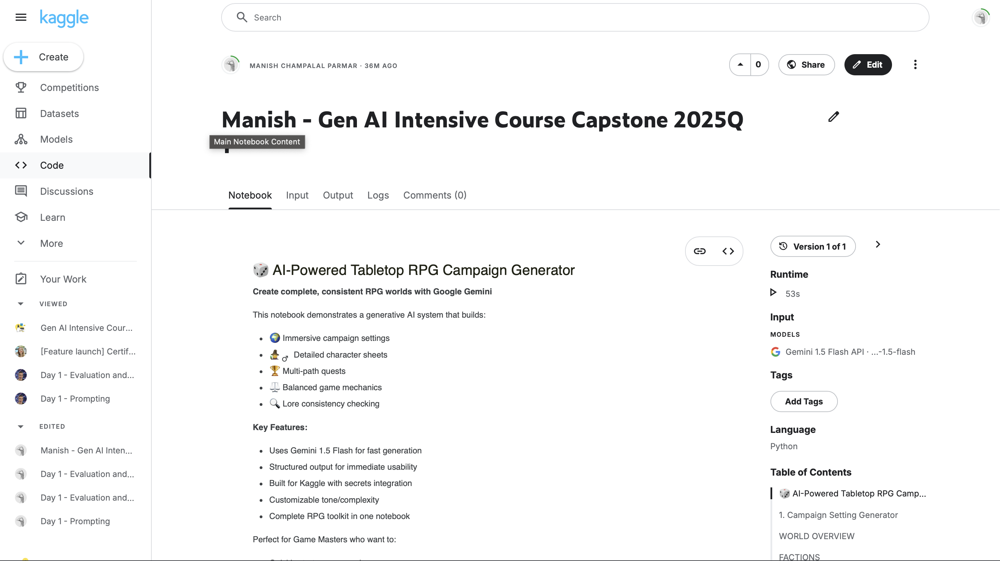
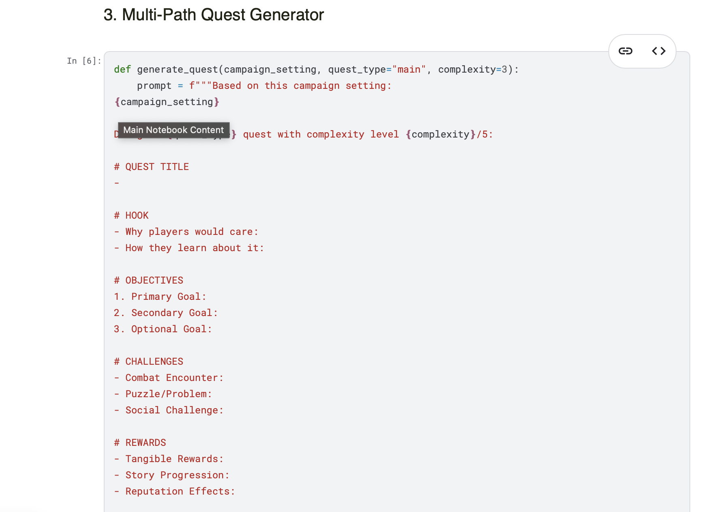
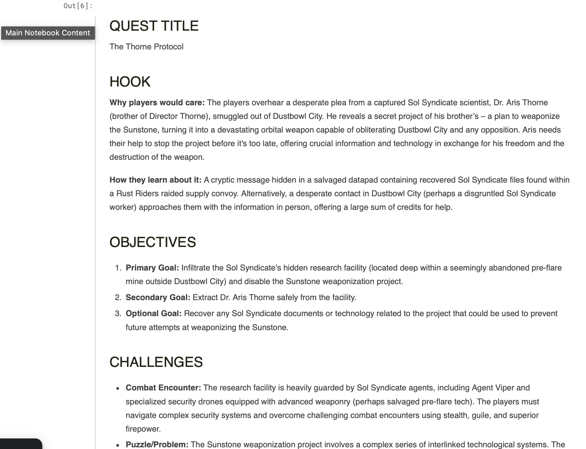

# 🎲 AI-Powered Tabletop RPG Campaign Generator

 

## 🌟 Overview
An advanced AI system that generates complete tabletop RPG worlds using Google Gemini. Creates immersive settings, detailed characters, multi-path quests, and balanced mechanics while maintaining lore consistency. Perfect for Game Masters who need quick world-building tools.

 

 

## 🚀 Features
- 🌍 **Immersive World Building**: Generate complete campaign settings with factions, locations, and lore
- 🧙 **Dynamic Character Creation**: Produce detailed character sheets with backstories and abilities
- 🏆 **Branching Quests**: Design multi-path adventures with meaningful choices
- ⚖️ **Balanced Mechanics**: Create custom game systems with proper risk/reward ratios
- 🔍 **Consistency Checking**: AI-powered validation for world continuity

## 🛠️ Tech Stack
**Core Technologies**:
- Google Gemini 1.5 Flash (Generative AI)
- Python 3.11
- Google Generative AI SDK
- IPython (for display formatting)
- Kaggle Secrets (for API key management)

## 📚 AI Concepts Implemented
1. **Structured Generation**  
   - Uses prompt engineering to create organized RPG content
   - Maintains consistent formatting across different content types

2. **Contextual Awareness**  
   - New content is generated with awareness of existing campaign elements
   - Consistency checker validates new content against established lore

3. **Multi-Modal Output**  
   - Generates both narrative content (stories, descriptions) and game mechanics
   - Balances creative writing with structured data requirements

4. **Parameterized Control**  
   - Adjustable complexity levels for different player needs
   - Customizable tone and theme settings

## 🧠 Skills Developed
- **Prompt Engineering**: Crafting effective prompts for structured AI output
- **AI Integration**: Implementing Google's Gemini API in Python
- **Game Design**: Balancing RPG mechanics and narrative elements
- **Data Validation**: Building consistency checks for generated content
- **Kaggle Deployment**: Configuring notebooks with secret management

## 📖 Development Process
1. **Setup Phase**  
   - Configured Gemini API with Kaggle secrets
   - Established base prompt templates

2. **Core Generators**  
   - Built campaign setting generator first as foundation
   - Developed character, quest, and mechanics systems
   - Implemented Markdown formatting for readability

3. **Enhancements**  
   - Added consistency checker for lore validation
   - Introduced parameter controls (theme, complexity)
   - Optimized for Kaggle notebook environment

## 🔗 Try It Out
)
*[Replace with your actual Kaggle notebook link]*

*Created as part of the Gen AI Intensive Course Capstone - March 2025*
